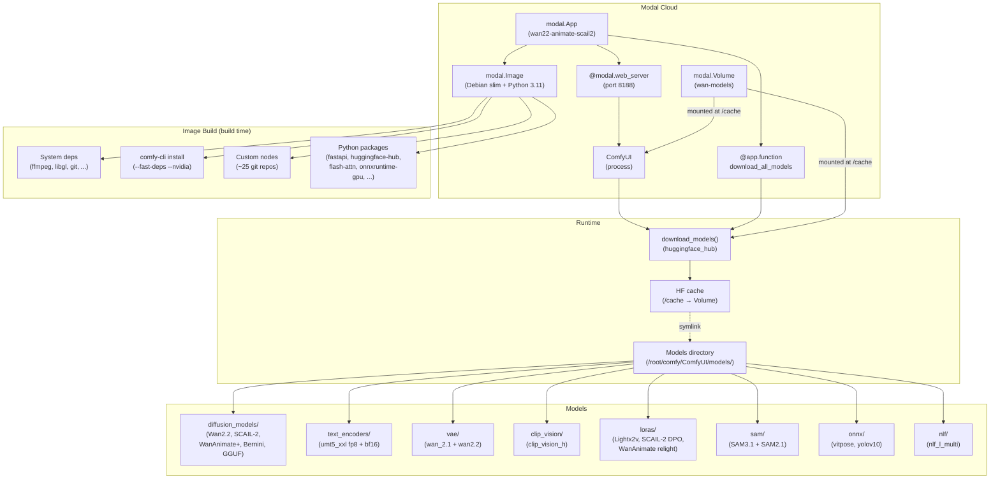

<!-- generated-by: gsd-doc-writer -->
# Architecture

## System Overview

Wan2.2Animate is a cloud-deployed ComfyUI server on [Modal](https://modal.com) that pre-loads video-generation diffusion models — Wan2.2, SCAIL-2, WanAnimate+, and Bernini — onto an A100-80GB GPU. Users deploy via the Modal CLI, then access a full ComfyUI web interface through a Modal-generated HTTPS endpoint. The system follows a **container-based serverless deployment** pattern: a custom Docker image is built with all dependencies (system packages, ComfyUI, ~25 custom node repositories), models are downloaded at runtime and cached in a persistent Modal Volume, and ComfyUI serves as the interactive frontend for loading/running workflows.

**Primary input**: Pre-built ComfyUI JSON workflow files (in `workflows/`).  
**Primary output**: Generated video frames and animations (written to `output/`).  
**Architectural style**: Serverless container deployment with persistent storage.

## Component Diagram



## Data Flow

1. **Deploy**: The user runs `modal deploy comfyapp.py`, which submits the image and app definition to Modal's cloud.
2. **Image build**: Modal builds the container image — installs system packages, runs `comfy-cli install` to download ComfyUI, clones ~25 custom node repositories, and installs Python dependencies.
3. **Model download**: At container start, `download_models()` runs inside the web server function. It uses `huggingface_hub` to download model files (with `HF_TOKEN` from the `huggingface` Modal secret). Each file is symlinked from the HuggingFace cache (`/cache`) into the appropriate ComfyUI models subdirectory.
4. **ComfyUI launch**: After model download completes, `comfy launch -- --listen 0.0.0.0 --port 8188` starts the ComfyUI process bound to port 8188.
5. **User access**: Modal exposes the web server via a public HTTPS URL. The user opens this URL in a browser, loads a workflow JSON from the `workflows/` directory, and runs inference.
6. **Model caching**: The `wan-models` Volume persists the HuggingFace cache (`/cache`) across redeploys. Subsequent deploys skip model downloads (symlinks already exist) and start ComfyUI in seconds.

## Image Build Details

The Modal image (`modal.Image.debian_slim(python_version="3.11")`) is layered as follows:

| Layer | Contents |
|-------|----------|
| **System packages** | `git`, `wget`, `ffmpeg`, `libgl1`, `libglib2.0-0`, `libsm6`, `libxext6`, `libxrender-dev`, `libfontconfig` |
| **Core Python** | `fastapi`, `comfy-cli==1.5.3`, `boto3`, `huggingface-hub>=0.26.0` |
| **ComfyUI install** | `comfy --skip-prompt install --fast-deps --nvidia --skip-manager` (nightly = latest master) |
| **Optional** | `pip install sageattention` (ignored if build fails) |
| **Custom nodes** | ~25 git clones — see "Custom Nodes" section below |
| **Additional Python** | `numpy`, `transformers>=4.40.0`, `flash-attn`, `ninja`, `packaging`, `safetensors`, `onnxruntime-gpu`, `opencv-python-headless`, `scipy`, `einops`, `accelerate`, `imageio`, `imageio-ffmpeg` |

## Custom Nodes

The following ComfyUI custom node repositories are cloned into `{COMFY_DIR}/ComfyUI/custom_nodes/` during image build:

| Repository | Description |
|------------|-------------|
| `ComfyUI-VideoHelperSuite` | Video frame loading and manipulation |
| `ComfyUI-WanVideoWrapper` | Kijai's WanVideo node wrappers |
| `ComfyUI-KJNodes` | General-purpose utility nodes |
| `ComfyUI-Custom-Scripts` | Pythongosssss's custom UI scripts |
| `rgthree-comfy` | Power user workflow nodes |
| `ComfyUI_Essentials` | Essential utility nodes |
| `was-node-suite-comfyui` | WAS Node Suite (image processing) |
| `cg-use-everywhere` | Route any node output anywhere in the graph |
| `ComfyUI-Frame-Interpolation` | Frame interpolation (CPU mode, no CuPy) |
| `ComfyUI-RMBG` | Background removal |
| `ComfyUI-Inpaint-CropAndStitch` | Inpainting helper |
| `ComfyUI-fofr-toolkit` | Fofr's toolkit utilities |
| `efficiency-nodes-comfyui` | Workflow efficiency and batching |
| `KayTool` | General-purpose tool nodes |
| `ComfyUI-WanAnimatePlus` | WanAnimate+ node pack (wuwukaka) |
| `ComfyUI-WanAnimatePreprocess` | Preprocessing (VitPose detectors) |
| `ComfyUI-SCAIL-Pose` | SCAIL-2 pose conditioning |
| `comfyui-scail2` | Faithful SCAIL-2 wrapper (llikethat) |
| `ComfyUI-SDPose-OOD` | Pose-conditioned generation |
| `ComfyUI_Swwan` | Swwan utility nodes |
| `ComfyUI-segment-anything-2` | SAM2 segmentation (Kijai) |
| `ComfyUI-GGUF` | GGUF model loader (city96) |
| `ComfyUI-Impact-Pack` | Impact Pack for advanced workflows |
| `ComfyUI-Manager` | ComfyUI custom node manager |
| `civitai-comfy-nodes` | Civitai model browser and downloader |

## Models Directory Structure

Models are stored under `{COMFY_DIR}/ComfyUI/models/` (`/root/comfy/ComfyUI/models/`) with the following subdirectory layout:

```
models/
├── diffusion_models/        # Core diffusion model weights
│   ├── wan2.2_i2v_high_noise_14B_fp8_scaled.safetensors
│   ├── wan2.2_i2v_low_noise_14B_fp8_scaled.safetensors
│   ├── wan2.1_14B_SCAIL_2_fp8_scaled.safetensors
│   ├── wan2.1_14B_SCAIL_2_fp16.safetensors
│   ├── SCAIL-2-Q5_K_M.gguf  (and Q6_K, Q8_0)
│   ├── Wan2_2-Animate-14B_fp8_e5m2_scaled_KJ_v2.safetensors
│   ├── Wan22_Bernini_HIGH_fp8_e4m3fn_scaled.safetensors
│   ├── Wan22_Bernini_LOW_fp8_e4m3fn_scaled.safetensors
│   ├── Wan2_2-Animate-14B_fp8_scaled_e4m3fn_KJ_v2.safetensors
│   ├── Wan22Animate/        # Symlink subdirectory
│   │   └── Wan2_2-Animate-14B_fp8_scaled_e4m3fn_KJ_v2.safetensors → ..
│   └── Wan22Bernini/        # Symlink subdirectory
│       ├── Wan22_Bernini_HIGH_fp8_e4m3fn_scaled.safetensors → ..
│       └── Wan22_Bernini_LOW_fp8_e4m3fn_scaled.safetensors → ..
├── text_encoders/
│   ├── umt5_xxl_fp8_e4m3fn_scaled.safetensors
│   └── umt5-xxl-enc-bf16.safetensors
├── vae/
│   ├── wan_2.1_vae.safetensors
│   ├── wan2.2_vae.safetensors
│   └── Wan2_1_VAE_bf16.safetensors
├── clip_vision/
│   └── clip_vision_h.safetensors
├── loras/
│   ├── Wan21_I2V_14B_lightx2v_cfg_step_distill_lora_rank64.safetensors
│   ├── lightx2v_I2V_14B_480p_cfg_step_distill_rank128_bf16.safetensors
│   ├── Wan21_I2V_14B_lightx2v_cfg_step_distill_lora_rank64_720.safetensors
│   ├── lightx2v_I2V_14B_480p_cfg_step_distill_rank64_bf16.safetensors
│   ├── wan2.1_SCAIL_2_DPO_lora_bf16.safetensors
│   ├── WanAnimate_relight_lora_fp16.safetensors
│   └── WanAnimate_relight_lora_fp16_resized_from_128_to_dynamic_22.safetensors
├── sam/
│   ├── sam3.1_multiplex_fp16.safetensors
│   └── sam2.1_hiera_large.safetensors
├── onnx/
│   ├── vitpose-l-wholebody.onnx
│   └── yolov10m.onnx
└── nlf/
    └── nlf_l_multi_0.3.2_fp16.safetensors
```

### Symlink Mechanism

Model files are not copied directly into the ComfyUI directory. Instead:

1. `huggingface_hub` downloads files into the HuggingFace cache under `/cache` (the mounted Volume).
2. The `_link()` helper creates a **symlink** from `{MODEL_DIR}/{subdir}/{filename}` pointing to the cached file.
3. If a symlink or file already exists, the download is skipped — enabling fast deploys after the initial run.

Post-download, the code also creates **symlink subdirectories** under `diffusion_models/` — `Wan22Animate/` and `Wan22Bernini/` — which contain symlinks back to the actual model files. This accommodates workflows that expect models in subdirectory paths.

## Storage Architecture

| Resource | Purpose | Mount Point |
|----------|---------|-------------|
| `modal.Volume("wan-models")` | Persists HuggingFace model cache across deployments | `/cache` |
| `Modal Secret("huggingface")` | Stores `HF_TOKEN` for authenticated HuggingFace downloads | Environment variable |
| Local `output/` directory | Generated video outputs (gitignored) | `output/` |

The Volume is **created once** (`create_if_missing=True`) and shared across all function invocations. It has a 1-hour timeout for model downloads and a 30-minute timeout for the web server function.

## Workflows

Ten ComfyUI JSON workflow files are in `workflows/`:

| File | Purpose |
|------|---------|
| `SCAIL-2_Animation.json` | SCAIL-2 video animation (primary) |
| `SCAIL-2_Animation_multi-char.json` | SCAIL-2 with multiple characters |
| `SCAIL-2_Animation_multi-ref.json` | SCAIL-2 with multiple reference images |
| `SCAIL-2_Animation_WAN-Context-Windows.json` | SCAIL-2 with context windowing |
| `SCAIL-2_Replacement.json` | SCAIL-2 inpainting / object replacement |
| `SCAIL2_simple.json` | Simplified SCAIL-2 workflow |
| `SCAIL2_multi_ref.json` | Multi-reference SCAIL-2 |
| `Wananimate.json` | WanAnimate+ animation workflow |
| `example_workflow_001.json` | General-purpose example |
| `example_workflow_bernini.json` | Bernini animation workflow |

> **Note**: Most workflows reference models beyond what is currently downloaded in `download_models()`. Workflows may fail if they require models (e.g., IPAdapter models, additional LoRAs, or specific CLIP variants) not included in the current download set. See the debug session `all-possible-failure` for details.

## Key Abstractions

| Abstraction | Description | Location |
|-------------|-------------|----------|
| `modal.App` | Top-level Modal application container (`wan22-animate-scail2`) | `comfyapp.py:377` |
| `modal.Image` | Container image definition with layered build steps | `comfyapp.py:171-371` |
| `modal.Volume` | Persistent storage for the HuggingFace model cache | `comfyapp.py:28` |
| `@modal.web_server` | Decorator that exposes a function as an HTTPS web server on port 8188 | `comfyapp.py:406` |
| `download_models()` | Module-level function that downloads and symlinks all model files | `comfyapp.py:35-164` |
| `_link()` | Helper that creates conditional symlinks from HF cache to ComfyUI model dirs | `comfyapp.py:49-61` |
| `@app.function` | Modal serverless function decorator (used for both download and web server) | `comfyapp.py:384,397` |
| `@modal.concurrent` | Limits concurrent requests (max 5) | `comfyapp.py:405` |
| `@app.local_entrypoint` | Modal local CLI entrypoint for pre-downloading models | `comfyapp.py:420` |

## Directory Structure Rationale

```
Wan2.2Animate/
├── comfyapp.py        # Single-file application: image build, model download, web server
├── workflows/         # ComfyUI JSON workflow files (user-facing)
├── output/            # Generated animation/video outputs (gitignored)
├── docs/              # Documentation
├── .env               # Local environment configuration (gitignored)
└── README.md          # Quick-start guide
```

The project is intentionally **flat and single-file** — `comfyapp.py` contains everything from the Modal image definition to the web server startup. This is appropriate for a Modal deployment where the entire application is a single container. The `workflows/` directory is separated because workflow JSON files are user-authored assets that need versioning, while the `output/` directory is gitignored because generated videos are large binary artifacts. Documentation lives in `docs/` to keep the root directory minimal.
