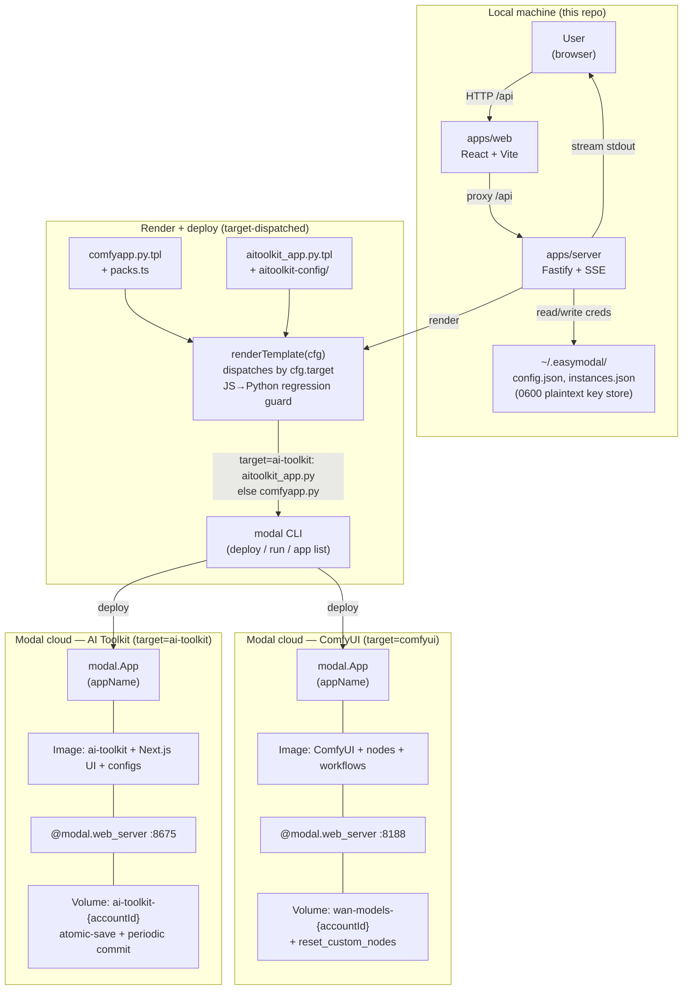

# Architecture

## System Overview

EasyModal is a **local orchestrator + web UI** that deploys one of two apps onto
[Modal](https://modal.com) serverless GPUs: [ComfyUI](https://github.com/comfyanonymous/ComfyUI)
(image/video generation) or [ostris/ai-toolkit](https://github.com/ostris/ai-toolkit) (LoRA
fine-tuning). The user picks the target in Configure; compute runs on their own Modal account.

The system has two halves:

1. **Local app** (this repo) — an npm-workspaces monorepo: a React/Vite frontend and a Fastify
   backend. The backend renders one of two Python templates, shells out to the `modal` CLI, and
   streams progress back over SSE.
2. **Deployed app** (on Modal) — built from the rendered `comfyapp.py` or `aitoolkit_app.py`. A
   custom Modal Image bundles the app + (for ComfyUI) selected custom nodes + workflow JSONs;
   a Modal Volume persists models and user state across cold starts.

**Architectural style**: local orchestrator driving serverless container deploys, with a
persistent-volume-backed symlink layer for state that survives container recycling.

## High-level diagram



## Component breakdown

### apps/web (frontend)

- **Stack:** React 18, Vite 6, TypeScript 5.7, Tailwind CSS v4, Zustand.
- **Pages** (`src/pages/`), one per step in the flow:
  - `SetupPage` — environment prerequisites check (Node version, `modal` CLI presence/version).
  - `KeysPage` — add/remove Modal accounts (each = label + Modal token id/secret + optional HF token),
    shows masked tokens + HF status. Calls `/api/accounts`.
  - `ConfigurePage` — hardware dropdowns (GPU/RAM/vCPU/concurrency/timeout/app name) + workflow-pack
    toggles. Persisted to `localStorage` (`easymodal-config`).
  - `WorkflowsPage` — browses the bundled workflow catalog (`/api/workflows`), grouped by pack,
    with download buttons.
  - `DeployPage` — account picker + config summary + deploy button. Streams milestones via SSE.
  - `LaunchPage` — lists all instances across accounts, with the live `*.modal.run` URL, Refresh,
    Copy link, Reset custom_nodes, Redeploy, Remove actions.
- **State:** `src/store/appStore.ts` (Zustand). Holds the current step, deploy config, and log
  buffer; persists to `localStorage`.
- **SSE:** `src/api/client.ts` `subscribeEvents()` opens an `EventSource` on `/api/events` and
  feeds every deploy log line + milestone into the store.

### apps/server (backend)

- **Stack:** Fastify 5, pino logging, TypeScript.
- **Entry:** `src/main.ts` — finds a free port (default `7421`, override via `PORT`), registers
  routes, serves the built web bundle in production, auto-opens the browser.

#### Route modules (`src/routes/`)

| Route file | Endpoints | Purpose |
|-----------|-----------|---------|
| `health.ts` | `GET /api/health` | Liveness probe. |
| `prereqs.ts` | `GET /api/prereqs` | Checks Node version + `modal` CLI path/version. |
| `accounts.ts` | `GET/POST /api/accounts`, `DELETE /api/accounts/:id`, `POST /api/accounts/validate(-hf)` | Add/remove/validate Modal + HF tokens. |
| `instances.ts` | `GET/POST /api/instances`, `DELETE /api/instances/:id`, `POST /api/instances/deploy`, `POST /api/instances/:id/refresh`, `POST /api/instances/:id/reset-nodes`, `POST /api/instances/:id/switch-account` | Deploy, list, refresh status, reset nodes, switch account. |
| `workflows.ts` | `GET /api/workflows`, `GET /api/workflows/:pack/:filename` | Browse/download bundled workflow JSONs. |
| `events.ts` | `GET /api/events` | SSE stream (`reply.hijack()`). |

#### Modal layer (`src/modal/`)

- **`cli.ts`** — the rendering core. **Dispatches by `cfg.target`.**
  - `renderTemplate(cfg)` → `renderComfyTemplate(cfg)` (default) or `renderAiToolkitTemplate(cfg)`.
  - ComfyUI path reads `templates/comfyapp.py.tpl`, substitutes `{{APP_NAME}}`, `{{GPU}}`,
    `{{MAX_INPUTS}}`, `{{TIMEOUT_SECONDS}}`, `{{MEMORY_MB}}`, `{{CPU}}`, `{{NODE_CLONES}}`,
    `{{EXTRA_MODELS}}`, `{{WORKFLOW_BUNDLE}}`.
  - AI Toolkit path reads `templates/aitoolkit_app.py.tpl`, substitutes `{{APP_NAME}}`, `{{GPU}}`,
    `{{MEMORY_MB}}`, `{{CPU}}`, `{{CONFIG_BUNDLE}}`.
  - `renderNodeClones(nodes)` → `.run_commands("cd …/custom_nodes && git clone URL[ && cd X && pip install -r requirements.txt]")` per node (ComfyUI).
  - `renderExtraModels(models)` → Python tuples appended to the `MODELS` list (ComfyUI).
  - `renderWorkflowBundle(workflows)` → base64-inlines each workflow JSON into
    `.run_commands("… | base64 -d > …/user/default/workflows/<file>")` (ComfyUI).
  - `renderAiToolkitConfigBundle()` → base64-inlines each YAML from `templates/aitoolkit-config/`
    into `/root/ai-toolkit/config/` (AI Toolkit).
  - `deployRenderedTemplate(cfg, cb)` writes `comfyapp.py` or `aitoolkit_app.py` to a temp dir
    and spawns `modal deploy`, streaming stdout/stderr line-by-line to callbacks.
- **`packs.ts`** — pack definitions.
  - `CORE_NODES`: 25 always-installed custom nodes (VideoHelperSuite, WanVideoWrapper, KJNodes,
    ComfyUI-Manager, Impact-Pack, SCAIL-Pose, WanAnimatePlus, …).
  - `PACKS`: `wan22` (core, empty extras), `image-edit` (Flux/Qwen/Ernie nodes + models),
    `upscaling` (SUPIR/SeedVR nodes + models).
  - `resolveNodes(packs)` / `resolveModels(packs)` dedupe + concatenate.
- **`milestones.ts`** — classifies raw `modal deploy` log lines into milestones
  (`image-building`, `models-downloading`, `comfyui-starting`, `url-ready`, `failed`) shown in the UI.

#### Accounts (`src/accounts/modal.ts`)

Thin wrappers over the `modal` CLI via `execFile`:

- `validateModalToken(id, secret)` — `modal token set` into a throwaway `easymodal-validate` profile,
  then `modal profile current` to confirm.
- `persistModalToken(id, secret)` — writes the token under the real profile.
- `activateAccountProfile(accountId, id, secret)` — writes the token under `easymodal-<accountId>` and
  marks it active. Called before every deploy / reset / switch so the right account is targeted.
- `setHuggingFaceSecret(token)` — `modal secret put huggingface HF_TOKEN=…` (idempotent).

> **Concurrency model:** one account active at a time. The active profile lives in `~/.modal.toml`.
> Account switching is serialized through the UI. (Per-account config-file isolation via
> `MODAL_CONFIG_PATH` is a documented future option if concurrent multi-account deploys are needed.)

#### Persistence layer (`src/repo/`)

- `configStore.ts` — `~/.easymodal/config.json` (0600). Stores accounts (with HF tokens) and
  the `activeAccountId`. Plaintext by design — matches `modal`/`aws`/`git` CLI conventions.
  Override location with `EASYMODAL_CONFIG_DIR`.
- `instances.ts` — `~/.easymodal/instances.json` (0600). Stores deployed-instance records
  (id, accountId, appName, config, status, url, timestamps, lastError).

### packages/shared

Shared TypeScript types consumed by both web and server: `Account`, `InstanceStatus`,
`DeployConfig`, `GpuOption` + `GPU_OPTIONS`, `RAM_OPTIONS_GB`, `CPU_OPTIONS`,
`TIMEOUT_OPTIONS_MIN`, `WorkflowPack` + `WORKFLOW_PACKS`, `LogEvent`, `Milestone`.

## The deployed ComfyUI app (the template)

`apps/server/templates/comfyapp.py.tpl` is the heart of the product. It is **rendered per-deploy**,
not edited directly. Rendered output is a complete Modal app.

### CONFIG (single source of truth, rendered from placeholders)

```python
CONFIG = {
    "app_name": "{{APP_NAME}}",
    "gpu": "{{GPU}}",
    "max_inputs": {{MAX_INPUTS}},
    "timeout_seconds": {{TIMEOUT_SECONDS}},
    "memory_mb": {{MEMORY_MB}},
    "cpu": {{CPU}},
}
```

### Image build (ordered layers)

1. `debian_slim(python_version="3.11")` base.
2. `apt_install` — git, wget, ffmpeg, libgl1, libglib2.0-0, libsm6, libxext6, libxrender-dev, libfontconfig.
3. `uv_pip_install` — fastapi, comfy-cli, boto3, huggingface-hub.
4. `run_commands` — `comfy --skip-prompt install --fast-deps --nvidia --skip-manager`.
5. `run_commands` — `pip install sageattention` (best-effort).
6. **`{{NODE_CLONES}}`** — one `.run_commands(...)` per custom node (core + selected packs).
7. `uv_pip_install` — numpy, transformers, ninja, safetensors, onnxruntime-gpu, opencv-headless,
   scipy, einops, accelerate, imageio, imageio-ffmpeg.
8. **`{{WORKFLOW_BUNDLE}}`** — base64-inline each bundled workflow JSON into
   `/root/comfy/ComfyUI/user/default/workflows/`.

### Volume + persistence

```python
vol = modal.Volume.from_name("{{VOLUME_NAME}}", create_if_missing=True)
CACHE_DIR = "/cache"
VOL_MODELS = f"{CACHE_DIR}/models"
```

The `{{VOLUME_NAME}}` placeholder is rendered per account by `volumeNameFor(cfg)` in `cli.ts` —
it becomes `wan-models-{accountId}` (ComfyUI) or `ai-toolkit-{accountId}` (AI Toolkit), so each
Modal account gets a fully isolated volume. See [CONFIGURATION.md](CONFIGURATION.md#deploy-target-which-app-gets-deployed).

Four directories are symlinked onto the volume so they survive cold starts:

| ComfyUI path | Volume path | Survives restarts? |
|--------------|-------------|--------------------|
| `models/` | `/cache/models` | Yes (prefetched by `download_all_models`) |
| `custom_nodes/` | `/cache/custom_nodes` | Yes (Manager installs persist) |
| `input/` | `/cache/input` | Yes (uploaded images/clips) |
| `output/` | `/cache/output` | Yes (generated images/videos) |
| `user/` | `/cache/user` | Yes (saved workflows, settings) |

`_link_to_volume(name, comfy_path, vol_path, image_baseline=...)`:
- If the volume dir is empty AND an image baseline exists (custom_nodes), it copies the image-baked
  baseline in — **even when the symlink already exists**. This is the re-seed path taken after a
  reset/switch wipe; without it, a wiped volume would stay empty forever.
- If `comfy_path` is already a symlink, the link is in place → done (warm boot).
- Otherwise it seeds the volume from the on-image dir, then replaces the dir with a symlink.

`ensure_persistent_dirs()` runs all four through `_link_to_volume` on every cold start.

### Functions

| Function | Purpose | GPU | Mounts volume |
|----------|---------|-----|---------------|
| `download_all_models()` | Prefetch all models to the volume (the "Prefetch" step). First run 15–30 min. | none (CPU) | Yes |
| `ui()` | `@modal.web_server(8188)`. Symlinks models + persistent dirs, spawns ComfyUI, **blocks until it answers HTTP** (closes the "URL handed out before ComfyUI is ready" gap). | `CONFIG["gpu"]` | Yes |
| `reset_custom_nodes()` | Wipes `/cache/custom_nodes` back to image baseline. Next cold start re-seeds. | none | Yes |
| `wipe_account_dirs()` | *(Legacy / unused.)* Previously wiped `custom_nodes`/`input`/`output`/`user` for an account switch. With per-account volumes this is no longer needed — switch-account is now a pure token swap. Kept in the template for now; safe to remove. | none | Yes |
| `main()` (local_entrypoint) | Runs `download_all_models.remote()` — used by `modal run comfyapp.py`. | — | — |

### The loading-fix

`ui()` does **not** call `download_models()` on every cold start (that caused the "URL loads for
hours" symptom — every cold container re-statted 30+ models while Modal's proxy held the browser
request). It only re-creates the model-dir symlinks (fast, idempotent) and health-polls ComfyUI
until it returns HTTP 200 before returning — so Modal never marks the container "ready" prematurely.

## The deployed AI Toolkit app (`aitoolkit_app.py.tpl`)

A separate template based on the original `aitoolkit_app.py` — not a ComfyUI node. Rendered when
`cfg.target === 'ai-toolkit'`. Key differences from the ComfyUI template:

- **Volume:** `ai-toolkit-{accountId}` (vs `wan-models-{accountId}` for ComfyUI), mounted at `/data`.
- **Port:** 8675 (Next.js UI) vs 8188.
- **Secrets:** `huggingface` + `ai-toolkit-auth`. The `ai-toolkit-auth` token is minted once
  on first deploy, **persisted per account** in `~/.easymodal/config.json` (`aiToolkitAuthToken`),
  and reused on every subsequent deploy — so ModHeader config stays stable across redeploys.
- **Bundled configs:** `templates/aitoolkit-config/*.yml` are base64-inlined into
  `/root/ai-toolkit/config/` via `{{CONFIG_BUNDLE}}`.
- **Safety patches:** `apply_safety_patches()` runs at web-server startup, before any training code:
  atomic safetensors writes (temp + `os.replace`), atomic `Network.save_weights` /
  `LoRANetwork.save_weights`, and a `BaseSDTrainProcess.save` hook that commits the volume after
  each training save. A background thread also commits every 30s. Together these make training
  resumable across container preemption.
- **Persistence:** `output`, `datasets`, and the Prisma job-queue SQLite DB are symlinked onto
  `/data`, so training jobs and datasets survive cold starts.

| Function | Purpose | GPU |
|----------|---------|-----|
| `download_models_remote()` | Prefetch LTX-2.3 + Gemma3 encoder (~71 GB) to the volume. | none (CPU) |
| `ui()` | `@modal.web_server(8675)`. Applies patches, symlinks dirs, `prisma db push`, model cache check, launches Next.js UI + cron worker via `concurrently`. | `{{GPU}}` |
| `main()` (local_entrypoint) | Runs `download_models_remote.spawn()` — used by `modal run aitoolkit_app.py`. | — |

> **Target support:** `reset_custom_nodes` is ComfyUI-only (AI Toolkit has no custom_nodes);
> the reset-nodes route returns a 400 for AI Toolkit instances. **Switch-account works for both
> targets** — it's now a pure token swap (each account has its own isolated volume, so there's
> nothing to wipe).

## Data flow: a deploy

1. User picks target + account + config (+ packs for ComfyUI), clicks Deploy → `POST /api/instances/deploy`.
2. Server `activateAccountProfile(accountId, …)` so the right account is targeted. If target is
   ai-toolkit, `ensureAiToolkitAuthSecret()` creates the auth secret and logs the token.
3. `deployRenderedTemplate(cfg, callbacks)`:
   - Renders the matching template → temp `comfyapp.py` or `aitoolkit_app.py`.
   - Spawns `modal deploy`.
   - Each stdout/stderr line → `classifyLine()` → milestone → SSE event → UI. The classifier
     recognizes both ComfyUI (`HARD:`/`ComfyUI`/`8188`) and AI Toolkit (`DOWNLOADED:`/`[UI]`/
     `[DB]`/`Starting Next.js`/`8675`) log patterns.
   - On a `*.modal.run` URL in the output, captured into the instance record.
4. Modal builds the image (or reuses cached layers), starts the `ui` function.
5. `ui()` mounts the volume, symlinks dirs, spawns the app, health-polls/commits, returns.
6. Modal publishes the HTTPS endpoint; the server captures the real URL (never guessed).
7. **Launch** step shows the URL (with the target label); user clicks **Open** 🚀.

## Security model

- Keys stored in `~/.easymodal/` (0600 plaintext), never in the repo. `.gitignore` excludes `.env`.
- No encryption layer — by design, matching `modal`/`aws`/`git` CLI conventions. The threat model
  is "single-user local tool," not multi-tenant.
- Tokens are sent to Modal's API via the `modal` CLI over HTTPS; nothing leaves the machine except
  to Modal/HuggingFace.
- The deployed ComfyUI endpoint is a public Modal URL (no auth gate). Anyone with the link can use
  it. Treat the URL as a secret; use Modal's access controls if you need to lock it down.
